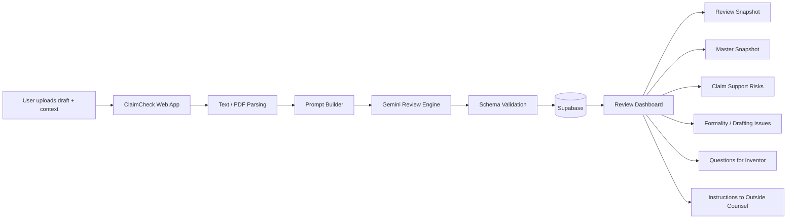
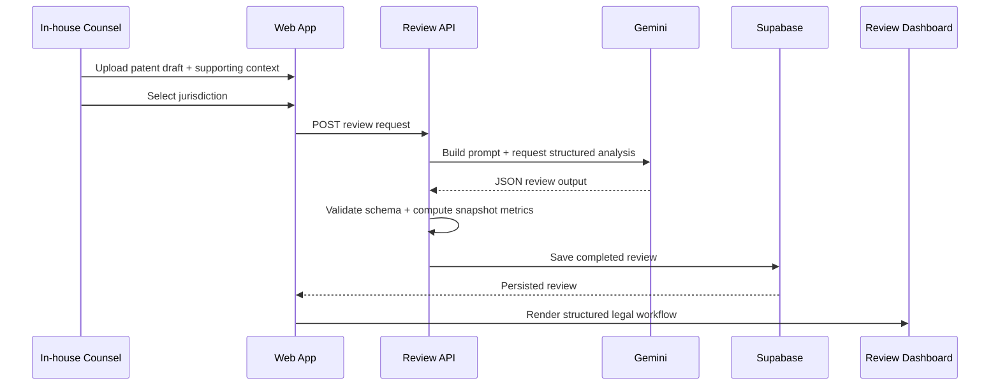

<div align="center">

# ClaimCheck

**An AI patent prosecution review copilot** for in-house patent counsel that helps legal teams review outside-counsel patent drafts faster, compare them against supporting context, surface claim-support and drafting risks, and generate clear next-step instructions for counsel.

<br/>


<br/>

</div>

---

**Hackathon:** Stanford LLM x Law Hackathon #6  
**Team:** Volodymyr Borysenko
**Track:** Harvey Challenge / Best Overall  
**Live demo:** Add deployed URL here  
**Local demo:** `http://localhost:3000`

---

## The Problem

Patent prosecution review is **slow, detail-heavy, and trust-sensitive**. In-house patent counsel often receives drafts from outside counsel through email and shared documents, then has to manually compare those drafts against invention disclosures, notes, and business context.

That process is painful because the reviewer needs to answer several high-stakes questions at once:

- What is this draft actually trying to protect?
- Does it align with the disclosed invention?
- Are the claims properly supported?
- Are there clarity, formality, or consistency issues?
- What should be sent back to outside counsel next?

Many teams already use general-purpose LLM tools, but that still leaves them with a new burden: **prompt engineering, context assembly, and output verification**.

**ClaimCheck is a purpose-built patent review workflow.**  
Instead of starting with a blank chat box, the reviewer uploads a patent draft, adds supporting context, selects a jurisdiction, and gets back a structured review designed for legal work.

---

## Built With

| Area | Stack |
|------|-------|
| **Frontend** | Next.js · React · TypeScript · Tailwind CSS |
| **Backend** | Next.js API routes |
| **LLM** | Gemini |
| **Persistence** | Supabase |
| **Validation** | Zod |
| **Parsing** | PDF/text extraction |
| **Deployment** | Vercel or local Next.js runtime |

---

## Architecture at a Glance



### End-to-end review cycle



---

## The Product

ClaimCheck is **not** a generic legal chatbot and **not** a patent drafting engine.

It is a narrow, high-value workflow for:

**Patent Draft + Supporting Context + Jurisdiction → Structured Review + Questions + Counsel Instructions**

The product is designed for **in-house patent counsel** who need a faster and more reliable way to review outside-counsel drafts without manually stitching together context and prompting a general LLM from scratch.

---

## Core Workflow

1. Upload or paste a patent draft.
2. Upload or paste supporting context such as invention notes or disclosure text.
3. Select jurisdiction.
4. Run review.
5. Receive a structured, attorney-friendly output with:
   - a top-level review snapshot
   - master summary of what the draft is covering
   - claim support risks
   - formality and drafting concerns
   - questions to resolve with the inventor
   - instructions to send back to outside counsel
   - a ready-to-use counsel transmission draft

---

## Review Snapshot

At the top of the results column, ClaimCheck surfaces a compact **Review Snapshot** that gives the reviewer an instant overview:

- **High-Risk Issues Found**
- **Missing Support Points**
- **Draft Email Ready**

This is the quick-read layer that makes the demo immediately understandable to judges and users.

---

## Trust Layer

ClaimCheck is built for a **trust-sensitive legal workflow**, so every issue can include a transparency layer such as:

- **Why flagged**
- **Source text**
- **Jurisdiction note**
- **Confidence**

This helps reduce verification time and makes the system feel more like a review workspace than a raw LLM output pane.

---

## Persistence

Completed reviews are stored in **Supabase** so the latest analysis can be reloaded on refresh and the demo feels like a real product rather than a one-shot response.

Saved review data includes:

- jurisdiction
- patent draft
- supporting context
- executive summary
- structured issues
- questions to resolve
- suggested revision instructions
- recommended email to counsel
- computed snapshot metrics

---

## What Makes This Different

| Generic LLM Workflow | ClaimCheck |
|----------------------|------------|
| User writes the prompt manually | Prompt is assembled for the workflow |
| Unstructured answer | Structured legal review |
| Weak product fit | Patent-specific review UX |
| No persistence | Saved review workspace |
| Generic AI vibe | Enterprise legal workflow feel |
| Hard to verify | Built-in transparency layer |

---

## Tech Stack

| Layer | Technology |
|-------|------------|
| **Language** | TypeScript |
| **Framework** | Next.js App Router |
| **UI** | React + Tailwind CSS |
| **LLM API** | Gemini |
| **Validation** | Zod |
| **Database** | Supabase |
| **Hosting** | Vercel |

---

## Project Structure

```bash
claimcheck/
├── app/
│   ├── page.tsx
│   └── api/
│       └── review/
│           └── route.ts
├── components/
│   ├── UploadPanel.tsx
│   ├── JurisdictionSelector.tsx
│   ├── ReviewSnapshot.tsx
│   ├── ReviewResult.tsx
│   └── HandoffPanel.tsx
├── lib/
│   ├── gemini.ts
│   ├── parser.ts
│   ├── prompt.ts
│   ├── schema.ts
│   └── supabase/
│       ├── client.ts
│       └── server.ts
├── public/
├── README.md
├── .env.local
└── package.json
```

---

## Quick Start

```bash
git clone https://github.com/VolodymyrLinuxovich/claimchecker.git
cd claimchecker
npm install
npm run dev
```

Open:

```bash
http://localhost:3000
```

---

## Environment Variables

Create a `.env.local` file in the project root:

```bash
GEMINI_API_KEY=your_gemini_key

NEXT_PUBLIC_SUPABASE_URL=your_supabase_url
NEXT_PUBLIC_SUPABASE_PUBLISHABLE_KEY=your_supabase_publishable_key
SUPABASE_SERVICE_ROLE_KEY=your_supabase_service_role_key
```

---

## Example Saved Review Schema

The app persists completed reviews in Supabase and computes a few product-facing metrics:

- `high_risk_count`
- `missing_support_count`
- `draft_email_ready`

This supports the Review Snapshot bar and gives the product a more realistic workspace feel.

---

## Why This Matters

ClaimCheck targets a real legal pain point: **reviewing outside-counsel patent drafts quickly, with structure and trust**.

Instead of replacing legal judgment, it helps attorneys:

- move faster
- review more systematically
- surface risks earlier
- reduce prompt engineering overhead
- generate clearer next actions

---

## Roadmap

### Hackathon version
- one polished review flow
- patent-specific output cards
- review snapshot
- persistence with Supabase
- strong legal UX and handoff area

### Future version
- citations and source highlighting
- draft-to-draft comparison
- export to counsel workflows
- team collaboration
- matter history
- jurisdiction expansion
- reviewer feedback loop

---

<div align="center">

**Built for patent review workflows, not generic chat.**

</div>
